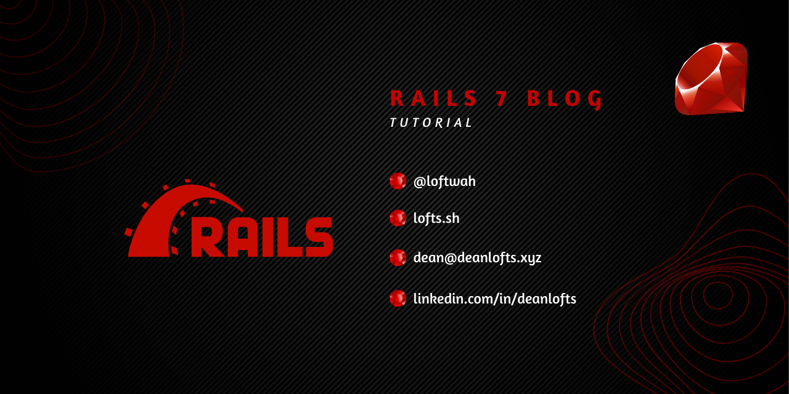
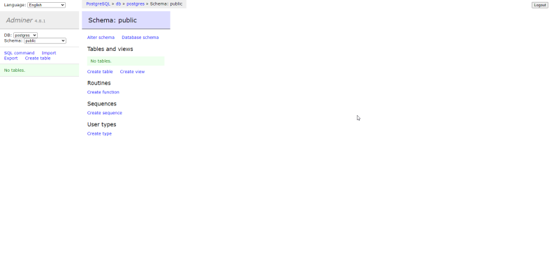

# My Rails Tutorial

[Getting Started with Rails](https://guides.rubyonrails.org/getting_started.html) | [API](https://api.rubyonrails.org/) | [Awesome Ruby](https://github.com/markets/awesome-ruby) | [Awesome Rails](https://github.com/gramantin/awesome-rails) | [More than "Hello World" in Docker: Build Rails + Sidekiq web apps in Docker](https://dev.to/raphael_jambalos/more-than-hello-world-in-docker-run-rails-sidekiq-web-apps-in-docker-1b37) | [Deploy Rails in Amazon ECS](https://dev.to/raphael_jambalos/deploy-rails-in-amazon-ecs-part-1-concepts-26nl)



This project is to teach myself Ruby on Rails. I am using Ubuntu in WSL2 (Windows Subsystem for Linux 2) and Ruby 2.7. This project requires Ruby and SQLite3. I will be using [this](https://guides.rubyonrails.org/getting_started.html) guide to get started.

<!-- START doctoc generated TOC please keep comment here to allow auto update -->
<!-- DON'T EDIT THIS SECTION, INSTEAD RE-RUN doctoc TO UPDATE -->
**Table of Contents**

- [Installation](#installation)
- [Running the Application](#running-the-application)
- [Docker](#docker)
- [Screenshots](#screenshots)
- [Ruby examples](#ruby-examples)
- [Todo](#todo)

<!-- END doctoc generated TOC please keep comment here to allow auto update -->

## Installation

Install gpg2

```bash
sudo apt install gnupg2 -y
```

Import keys and install RVM (Ruby Version Manager)

```bash
curl -sSL https://rvm.io/mpapis.asc | gpg2  --import -
curl -sSL https://rvm.io/pkuczynski.asc | gpg2 --import -
\curl -sSL https://get.rvm.io | bash -s stable
source /home/loftwah/.rvm/scripts/rvm
rvm install 2.7 # Rails 7 requires Ruby 2.7
```

Check that Ruby is installed.

```bash
ruby -v        
ruby 2.7.2p137 (2020-10-01 revision 5445e04352) [x86_64-linux]
```

Install SQLite3

```bash
sudo apt install sqlite3 -y
sqlite3 --version
3.31.1 2020-01-27 19:55:54 3bfa9cc97da10598521b342961df8f5f68c7388fa117345eeb516eaa837balt1
```

Jnstall Rails

```bash
gem install rails
rails --version
Rails 7.0.3.1
```

We can now create a new Blog application as per the guide we are following.

```bash
rails new blog
```

> *Note:* `rails new --help` will show you all the options available.

The following directories will be created and this is the explanation of what they are and what they do.

| File/Folder | Purpose |
| ------------ | ------- |
| app/ | Contains the controllers, models, views, helpers, mailers, channels, jobs, and assets for your application. You'll focus on this folder for the remainder of this guide. |
| bin/ | Contains the `rails` script that starts your app and can contain other scripts you use to set up, update, deploy, or run your application. | 
| config/ | Contains configuration for your application's routes, database, and more. This is covered in more detail in [Configuring Rails Applications](https://guides.rubyonrails.org/configuring.html). |
| config.ru | Rack configuration for Rack-based servers used to start the application. For more information about Rack, see the [Rack website](https://rack.github.io/). |
| db/ | Contains your current database schema, as well as the database migrations. |
| Dockerfile | Contains the Dockerfile and container requirements for your application. |
| docker-compose.yml | Contains instructions on how to run your application in a Docker container using Docker Compose. |
| Gemfile & Gemfile.lock | These files allow you to specify what gem dependencies are needed for your Rails application. These files are used by the Bundler gem. For more information about Bundler, see the [Bundler website](https://bundler.io). |
| lib/ | Extended modules for your application. |
| log/ | Application log files. |
| public/ | Contains static files and compiled assets. When your app is running, this directory will be exposed as-is. |
| Rakefile | This file locates and loads tasks that can be run from the command line. The task definitions are defined throughout the components of Rails. Rather than changing `Rakefile`, you should add your own tasks by adding files to the `lib/tasks` directory of your application. |
| README.md | This is a brief instruction manual for your application. You should edit this file to tell others what your application does, how to set it up, and so on. |
| storage/ | Active Storage files for Disk Service. This is covered in [Active Storage Overview](https://guides.rubyonrails.org/active_storage_overview.html). |
| test/ | Unit tests, fixtures, and other test apparatus. These are covered in [Testing Rails Applications](https://guides.rubyonrails.org/testing.html). |
| tmp/ | Temporary files (like cache and pid files). |
| vendor/ | A place for all third-party code. In a typical Rails application this includes vendored gems. |
| .gitattributes | This file defines metadata for specific paths in a git repository. This metadata can be used by git and other tools to enhance their behavior. See the [gitattributes documentation](https://git-scm.com/docs/gitattributes) for more information. |
| .gitignore | This file tells git which files (or patterns) it should ignore. See [GitHub - Ignoring files](https://help.github.com/articles/ignoring-files) for more information about ignoring files. |
| .ruby-version | This file contains the default Ruby version. |

## Running the Application

To start the web server, run the following command.

```bash
bin/rails server
```

This starts the Puma web server on port 3000. Navigate to [localhost:3000](http://localhost:3000) to see the application.

## Docker

[Ruby](https://hub.docker.com/_/ruby) | [PostgreSQL](https://hub.docker.com/_/postgres/) | [Adminer](https://hub.docker.com/_/adminer/)

We can run this application in a Docker container using Docker Compose. If you don't have Docker installed please click [here](https://docs.docker.com/get-docker/) for the instructions.

```bash
docker-compose build
docker-compose up # or if you want it in the background
docker-compose up -d
```

## Screenshots

| Screenshot | Description |
| ---------- | ----------- |
|  | Blog Articles |
|  | Read Article |
|  | Adminer |

## Ruby examples

These are some examples of how to do things in Ruby.

- basics

```ruby
"Dean" #=> String
7         #=> Integer
6.9       #=> Float
[1,2,3]   #=> Array
(1..10)   #=> Range
false     #=> FalseClass (Boolean)
true      #=> TrueClass (Boolean)
nil       #=> NilClass
name = "Dean"
name.upcase
# Print the result of 4 + 8 to the terminal
puts 4 + 8
puts name # "Dean" "DEAN"
```

- methods

```ruby
# DRY (Don't Repeat Yourself)!!!!!
# puts "Hello Dean, how are you?"
# puts "Hello Scott, how are you?"
# puts "Hello Stephanie, how are you?"
# puts "Hello Luke, how are you?"
# method definition (the code inside WON'T RUN until the method is called!)
# def greet_person
#   puts "HI!"
# end
# DRY method with one parameter (name)
def greet_student(name)
  puts "Hello #{name}, how are you today? :)"
end
# we ommit the () characters if we don't have arguments!
# greet_person
# greet_person
# we're calling the method greet_student with the ARGUMENT 'Dean'
greet_student('Dean')
greet_student('Scott')
greet_student('Stephanie')
greet_student('Luke')
def full_name(first_name, last_name)
  first_name = first_name.capitalize
  last_name = last_name.capitalize
  return "#{first_name} #{last_name}"
end
# full_name is returning nil!
name = full_name('deAn', 'loFtS')
puts name
def max(number_1, number_2)
  return 0 if number_1 == number_2
  if number_1 > number_2
    return number_1
  else
    return number_2
  end
end
maximum = max(5, 6) # => 6
puts maximum # => 6
def upcased_name(name)
  5 + 6
  new_name = name.downcase
  # return new_name
  name.upcase
end
upcased = upcased_name('dean')
puts upcased
def stupid_method
end
result = puts('Dean')
puts result
require 'date'
def tomorrow
  tomorrow_date = Date.today + 1
  return tomorrow_date.strftime("%B %d")
end
puts tomorrow   # => "September 2"
```

- strings

```ruby
puts "Gday mate"
puts 'Gday mate'
name = 'Dean'
age = 36
# Concatenation of strings
# puts 'Hello' + ' ' + name + ' ' + 'how are you?'
puts 'You are' + ' ' + 36.to_s + ' ' + 'years old'
# Interpolation of strings (needs double quotes!)
# puts "Hello #{name} how are you?"
puts "You are #{35 + 1} years old"
```

- variables

```ruby
# variable names should be lower snake case
user_city = 'Melbourne'
age = 36 # assigning a variable value
age_in_four_years = age + 4
age = age + 4 # re-assignment
age += 4 # sugar syntax to age = age + 4
puts age #=> 40
age = 40 # re-assignment
puts age #=> 40
```

## Todo

- [ ] Add postgresql
